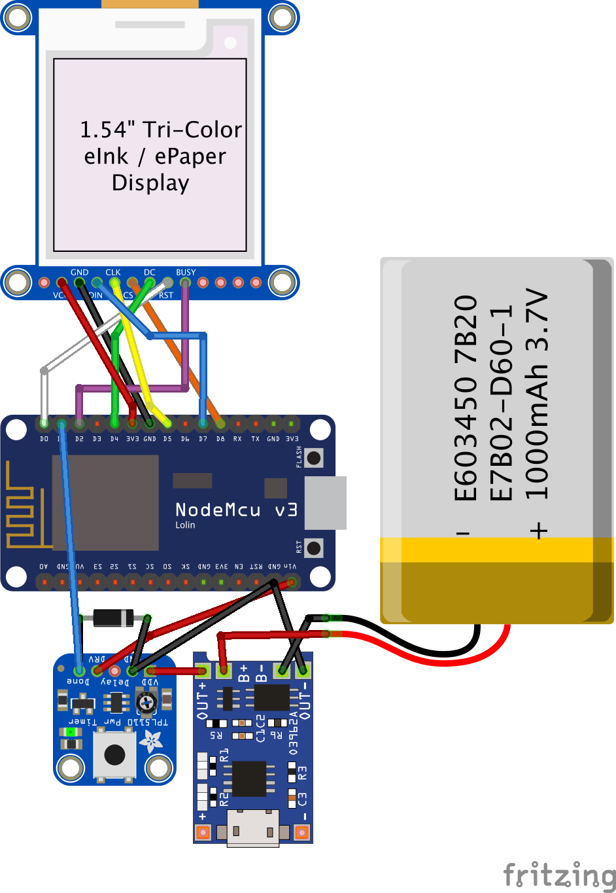

# CalendarMe
This is just a project that I created for my son. At this moment (2020) he hasn't got his own mobilephone and I want to give him the oppertunity to see upcoming appointments. 

## Parts

### Adafruit TPL5110 Low Power Timer Breakout
<https://www.adafruit.com/product/3435>
This is a nice timer that is placed right in front of the Arduino-Board. It powers up the arduino at an interval (up to 2 hours) that can be changed by a poti. With this in place there is no need for a deep-sleep, which is - especially for the NodeMCU - to battery-consuming. 

For me the TPL5110 only works with the NodeMCU by soldering a diode from GND to DONE. 

### Waveshare 1.54inch e-Paper Module (B)
<https://www.waveshare.com/wiki/1.54inch_e-Paper_Module>
I bought the version with red color, but for this project there is no need for the color. My red color is so light that I doesn't want to use it. Probably that is a hardware-defect. If you have the BW-Version you have to use another constructor for it in the Code. 

### NodeMCU Lua Amica ESP8266
<https://www.az-delivery.de/en/products/nodemcu>

### TP4056 USB Lithium Li-Ion Battery Charger Module
Lipo charger. The one I used in fritzing has separated pins for battery and output - mine has no separated pins. 

### 3,7 V 1000 mAh Lipo
Lipo for powering

## Configure

### Google-Calendar
1. Create unter http://script.google.com/ a new app with the code from google-calendar-script.gs.
2. Replace the calendar-id inside the script
3. Deploy app with Publish > Deploy as web app (Access: Anyone, even anonymous)
4. If you update always choose under Project version "New"
5. Copy the Script-Id inside the Web app URL -> you will need this in the credentials.h in the arduino-code

### Arduino-Code
1. Fill in the values in credentials.h
2. Verify connection-settings at main.cpp-> // E-Paper + NodeMCU
3. Use the correct constructor for your display (e.g. if it is not a colored display use another than GxEPD2_3C)
4. Upload to Arduino

## Connect
I had some problems to get the right GPIO-Setup for the TPL5110 and e-Paper Module. Especially the DONE-Pin on the TPL only works on some GPIOs and the RST-Pin on the e-paper does not fit to every NodeMCU-pin. I think this is because the NodeMCU has a HIGH-status on some pins while powering up. 

## 3D-printed case
<https://www.thingiverse.com/thing:4483551>